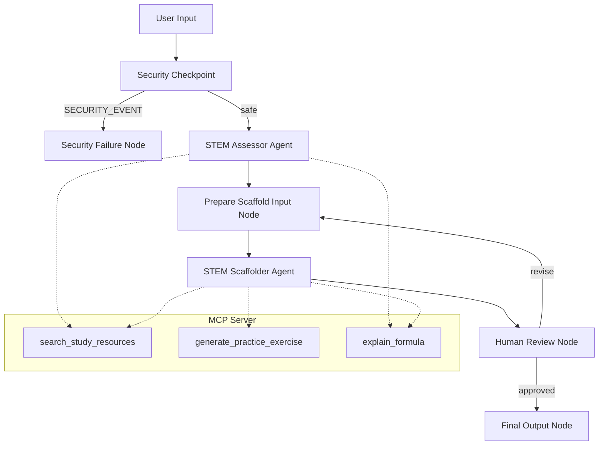

# Submission Write-Up: EduPath (STEM Curriculum Scaffolder)

## Problem Statement
Standard educational curricula are often rigid, pacing all students at the same speed regardless of their unique background gaps. In STEM fields, this is particularly problematic: a student who struggles with calculus is often just missing foundational concepts in algebra or trigonometry. EduPath solves this by offering a highly personalized, secure, and interactive learning tool that assesses specific student struggles and dynamically constructs custom, week-by-week curriculum plans.

## Solution Architecture
EduPath uses the graph-based ADK 2.0 Workflow API to structure a robust multi-agent orchestration pipeline.

## Concepts Used

1. **ADK 2.0 Workflow Graph**: The entire pipeline is built on the graph route engine (`Workflow`) allowing strict state execution and validation (see [app/agent.py](file:///P:/5%20Day%20Google%20Program/adk%20workspace/edupath/app/agent.py#L182-L198)).
2. **LlmAgent Nodes**: Used for specialized sub-agents `assessor` and `scaffolder` with structured Pydantic input/output schemas (see [app/agent.py](file:///P:/5%20Day%20Google%20Program/adk%20workspace/edupath/app/agent.py#L42-L73)).
3. **MCP Server & Toolset**: Integrates external tools using the Model Context Protocol (MCP) to lookup study resources, solve math formulas, and generate practice problems (see [app/mcp_server.py](file:///P:/5%20Day%20Google%20Program/adk%20workspace/edupath/app/mcp_server.py) and [app/agent.py](file:///P:/5%20Day%20Google%20Program/adk%20workspace/edupath/app/agent.py#L35-L40)).
4. **Security Checkpoint**: Implements PII scrubbing, prompt injection checks, domain keyword checking, and audit logging as a gating workflow node (see [app/agent.py](file:///P:/5%20Day%20Google%20Program/adk%20workspace/edupath/app/agent.py#L77-L141)).
5. **Agents CLI & Scaffold**: Used to generate the initial files and provide interactive testing facilities (playground).

## Security Design

1. **PII Scrubbing**: Educational tools are used by students who may accidentally share personal data (emails, phones, Student ID numbers). The check intercepts and replaces these with neutral identifiers (e.g. `[EMAIL]`) so they never reach the LLM or third-party APIs.
2. **Prompt Injection Checks**: Prevents students from jailbreaking the assessor to write essay drafts or output inappropriate content. Inputs containing words like `ignore previous instructions` or `jailbreak` are routed to an immediate safety block.
3. **Structured Audit Log**: Outputs structured JSON containing timestamp, severity, session ID, and actions taken (e.g., `ALLOW`, `SCRUB_AND_CONTINUE`, `BLOCK`). This supports real-time monitoring and safety compliance auditing.
4. **Domain Content Filtering**: Rejects requests requesting instructions on illegal or harmful topics (e.g. "bomb", "weapon", "hack"), ensuring the tool remains strictly academic.

## MCP Server Design
The MCP server exposes three main domain-specific tools:
* **`search_study_resources`**: Returns Khan Academy and OpenStax textbook references for specific topics.
* **`generate_practice_exercise`**: Dynamically crafts scaffolded problems (beginner, intermediate, advanced) with worked solution guides.
* **`explain_formula`**: Breaks down equations (such as the quadratic formula or Newtonian equations), detailing all variables and units.

## HITL Flow
The **Human-in-the-Loop** step is implemented in the `human_review` node. Once the curriculum is generated:
1. The workflow pauses using ADK's `RequestInput`.
2. The user sees the formatted markdown curriculum and is prompted for approval or feedback.
3. If they enter adjustments (e.g., "Add more exercises"), the feedback is saved to state and the workflow loops back to `prepare_scaffold_input` to revise the curriculum.
4. If approved (e.g. "yes"), it finishes at the `final_output` node.

This step is critical because students deserve final agency over what and how they study.

## Demo Walkthrough

1. **Initial Assessment**: The student types `"I struggle with calculus limits"`. The assessor uses `explain_formula` to check limit properties, then flags basic algebraic factoring as a prerequisite weakness.
2. **Curriculum Creation**: The scaffolder takes the weakness report and creates a 4-week module structure with Khan Academy links.
3. **Refinement**: The student requests: `"Include a practice problem for Week 1"`. The workflow loops back, calling the MCP tool `generate_practice_exercise` to inject a quadratic factoring challenge.
4. **Finalization**: The student reviews the update, inputs `"yes"`, and the curriculum is saved as the final output.

## Impact & Value Statement
EduPath bridges the gap between passive learning and active student success. By identifying exact foundational weaknesses and dynamically generating structured curricula supported by academic lookup tools, it offers a custom learning coach to any student, anywhere, for free. It saves teachers valuable grading time and empowers students to master difficult concepts at their own pace.
